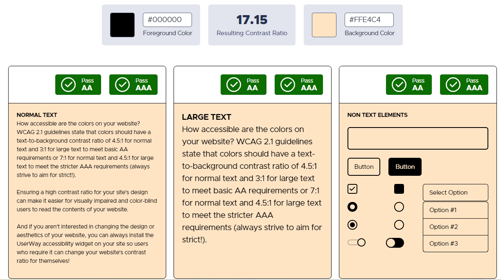
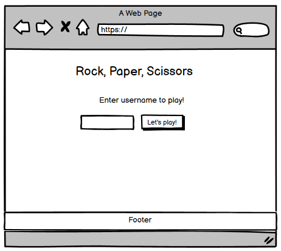
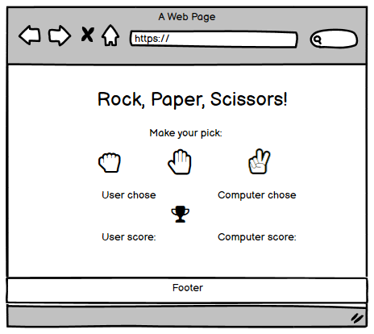
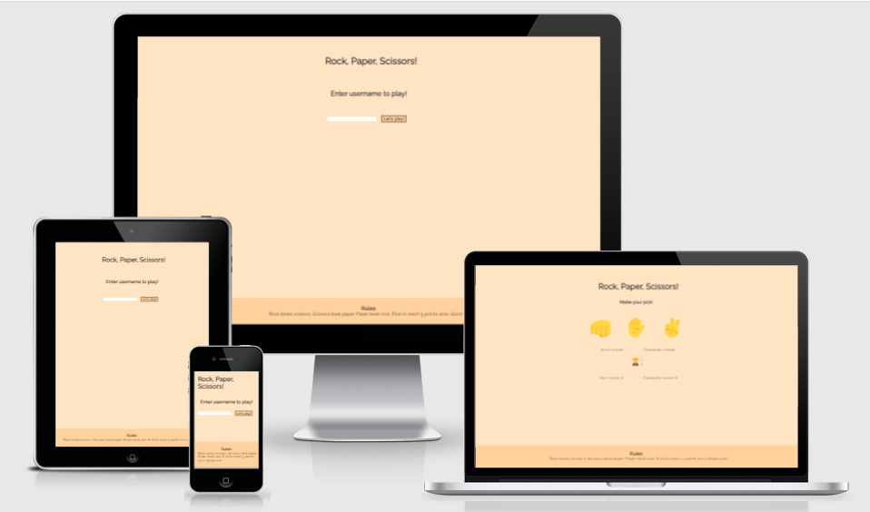
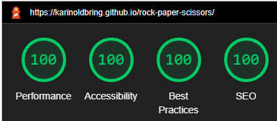
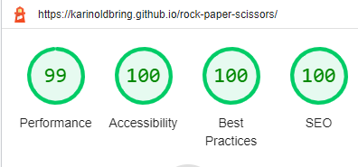

# **Rock, Paper, Scissors**
Rock, paper, scissors is a website where users can play the classic game of Rock, Paper or Scissors. You start the game by entering a username to get a more personal feeling.  Your computer is your opponent and the first of you to reach 5 points wins the game. 

## **Table of Contents**
* [Planning Stage](#planning-stage)
    * Project Goals
    * User Goals
    * Design Goals
    * Design Choices
        * Font
        * Color Scheme
    * Wireframes 
* [**Features**](#features)
    * Future Features to be Added
* [**Testing**](#testing)
    * Responsiveness
    * Lighthouse
        * Desktop
        * Mobile
    * Validators
* [**Bugs**](#bugs)
    * Fixed Bugs
    * Known Bugs
* [**Technology Used**](#technology-used)
    * Languages
    * Libraries
* [**Deployment**](#deployment)
* [**Credits**](#credits)
    * Content
    * Thanks

## **Planning Stage**

### Project Goals
The goal of this project was to create an easy game for users to play. To make the site more personal the player chooses its personal username to start playing. 

### User Goals
The target user is someone who has some time to kill or just want a quick break. 
    * An easy-going gamer. 
    * Someone who wants a break and get some distraction. 
    * Looking to settle a dispute with someone by battling their device. 

### Design Goals
    * A simple site that works on all devices. 
    * Clean and minimalistic design to enhance user experience. 
    * Despite the simplicity of the game itself the site aims to give a refined feel. 
    * Easy to understand and use. 
    * The stylish and clean design aims to get the user to return to the site. 

### Design Choices

#### Font
When designing Rock, Paper, Scissors I wanted to give the site a clean and sophisticated, but yet soft look, and hence I chose a single font from Google Fonts falled [Raleway](https://fonts.googleapis.com/css2?family=Raleway&display=swap) which I think fulfills the stated purpose. 

#### Color Scheme
I chose a color scheme that gives the site a delicate look and well matches the icons. Very important to me was to ensure that the contrasting colors work well. I chose the default yellow color for the hands, hence on purpose not selecting a specific ethnicity or skin tone and therefore remaining neutral. I find that the bisque background-color goes well with the icons and chose black for the font to keep site neat. 
    * Background-color: #ffe4c4
    * Font-color: #000000
To check the contrasting colors I chose (https://userway.org/). 

### Wireframes
I used wireframes to plan my project. THe main alteration I made was using creating a hide-function to show only sign-in area first and then show only game area. The site looks pretty much the same regardless of which device is being used. 

## **Features**

### Signin-area
    * The signin function was added to give the player a more personal touch. The name inserted is displayed in the following game area. 
    * To make it extra clear to the player what to do first i.e enter username, and for layout purposes, I chose to hide the game area when entering the site. 
    * If no username is entered, an alert will show up urging the user to enter a name. 

### Game area
    * When entering the game area the sign in is hidden and the players name is displayed on the site. The player is encouraged to make a pick and the icons scale up when hovered to improve user experience. 
    * Once the player has made a move the computer automatically makes a counter move and the result is displayed. 
    * For each draw the score is incremented, except for when there's a draw. 
    * When one player reaches 5 points an alert appears to tell who's the winner. 
    * Score and previous choice is reset when game is over, making it easy to start a new round. 

## **Features to be added**
    * Possibility to play against someone else, by sending an invitation. 
    * Increment score function for each round won, encouraging player to play multiple rounds. 

## **Testing**
The site has been tested on Chrome, Edge and Firefox, there was an issue with Firefox that is now resolved, more information regarding this in the Bugs section below. The site has also been tested on iPhone and Android devices with a minor bug concerning iPhone, this is also further displayed in the Bugs section below. 

### Responsiveness

I have performed extensive testing to make sure that the site is fully responsive on small, medium and large size screens. As well as testing in dev tools and using various mobile devices I also used "Am I Responsive" to ensure responsiveness. On very small screens some scrolling is needed if device is used in horizantal mode. 
To make sure the site works well on all screen sizes I found two different key widths were necessary. 
1 **Smaller devices with max-height 550px and below**
    * Decreased the margin-top on h1. 
    * Decreased font-size and adjusted margin for the buttons and the score-area. 
2 **Smaller devices with max-width of 450px and below**
    * Decreased the margin-top on h1. 
    * Decreased font-size and adjusted margin for the buttons and the result-area.

### Lighthouse
The site has been tested with Lighthouse for both desktop and mobile versions, scoring between 99-100. 
    ## Desktop
    
    ## Mobile
    

### **Validators**
All HTML files were run through (https://validator.w3.org/nu/#textarea) and my CSS file was run through (https://jigsaw.w3.org/css-validator/validator) to ensure all code meet the correct standard. No errors or warnings were found for HTML or CSS. 
The JavaScript file, was run through (https://jshint.com/) and showed no errors. Swal, used for the sweet alert, is stated as an undefined variable since it is an external file, declared in a third party library. 

## **Bugs**
During the decelopment of Rock, Paper, Scissors I encountered numerous obstacles and bugs. The main ones are listed below. 
    
### Fixed Bugs
    * Bug: When trying the site on Firefox I discovered that the scissors-hand wasn't displayed correctly. I had copied the emoji symbols from (https://www.w3schools.com/charsets/ref_emoji.asp) and they worked fine everywhere accept for that specific emoji in Firefox. 
        * Fix: I tried a number variants such as checking that the latest version of font was installed and checking that there were no content blockers, but nothing worked. After consulting my mentor he tried using (https://emojipedia.org/) instead which worked perfectly. 
    * Bug: When using smaller screens horizontally, the user needs to scroll to see the footer. Scrolling may not be ideal but the two options I could think of would not be better. The first option would be making the game area a lot smaller using media queries, but since the user needs to touch the screen to play that would seem like an error-prone fix. The second would be to make some kind of button for the user to click to show the rules stated in the footer, but that would probably take even more effort from the user than just scrolling. Hence, I chose to keep the site a bit larger in size, leaving the user to do a little bit of scrolling if in need of the rules. 

### Known Bugs
    * When entering the site using iPhone, the site automatically zooms in. If you zoom out the page works as intended but each time you enter the site, and after entering username to get to the gamearea, you need to zoom out. Despite hours of online search and consulting my mentor I have not been able to fix this issue unfortunately. Note that this issue seems to only appear using iPhone, not Android. 

## **Technology Used**

### Languages
    * HTML
    * CSS
    * JavaScript

### Libraries
    * [Sweet Alert 2](https://sweetalert2.github.io/) - For alert if not entering username and game over. 
    * [Emojipedia](https://emojipedia.org/) - For emoji-buttons. 
    * [Favicon images](https://realfavicongenerator.net/).

## **Deployment**
I deployed the website on GitHub pages via the following steps: 
1. From the projects repository go to the **settings** tab.
1. On the left hand menu near the bottom click on the **pages** link.
1. Under **Source** click on the button "None" which will produce a drop down.
1. Click on **Main** and then click **Save**.
1. The following message will appear:  **Your site is ready to be published**.
1. After a few minutes the site will be published and the message will change to **Your site is published**.

The live site can be accessed via the following link [Rock, Paper, Scissors](https://karinoldbring.github.io/rock-paper-scissors/). 

## **Credits** 

### Content 
The Rock, Paper, Scissors game was inspired by (https://www.youtube.com/watch?v=1yS-JV4fWqY) and (https://www.youtube.com/watch?v=RwFeg0cEZvQ). Whilst I've tried to deviate as much as possible, and added additional features and functions, there may be som similarities in the code. 

### Thanks 